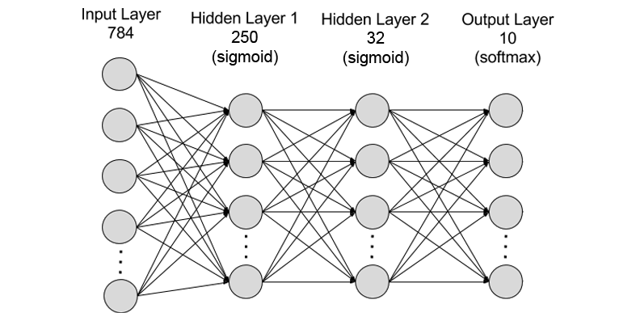

<div align="center">


<h1>MNIST Neural Network</h1>

<h5>A Simple Neural Network in Python and Numpy.</h5>


</div>

## Dependencies

- [Python](https://www.python.org/downloads/) >= v3.7
- [Pip](https://pypi.org/project/pip/) >= v21.3
- [Numpy](https://numpy.org/) >= v1.21.4

## Installation

clone the project:
```
git clone https://github.com/eyalmichon/MNIST-neural-network.git
```
then inside the project folder use the following command to create a new virtual environment:
```
python -m venv .venv
```
then use the following command to install required packages:
```
pip install -r packages.txt 
```
make sure all of the dependencies are installed if you've encountered any errors.

# The Network

<div align="center">

</div>

## Running & Usage
Unzip the test and train files from train_test.zip

```
python net.py train_x train_y test_x test_y
```
The network will now train based on the train_x/y set and when done will test prediction accuracy of the weights and biases trained on the test_x/y files.

## Editing the layers

Editing the layers is possible on line 115:
```python
layers = [len(train_x[0]), 250, 32,  10]
```
It's possible to add any amount of layers and change the amount of neurons per layer.